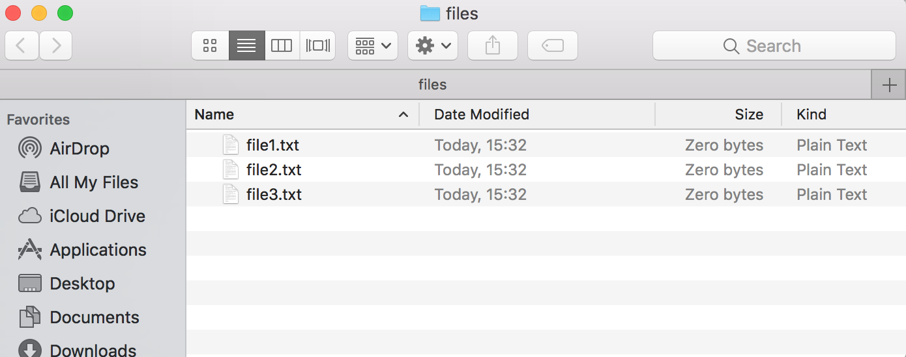

# Linux command line basics (continued)

### ls

The list (ls) command allows you to list the contents of your current directory. Using this command, you can find out which files you can work with inside the current folder. 

Suppose you have the follow folder structure:


In the terminal, we can view the contents of this folder like this:

```console
user:~/topsecret/files$ ls
file1.txt file2.txt file3.txt
```

By default, ```ls``` shows us the files that would normally be visible in a GUI interface. However there can sometimes be hidden files. To view these, we use ```ls -a```. Hidden files usually start with a period in their names. In this example, the hidden file is ```.gitignore```. The two periods: (`..`) refer to the parent folder. The single period ```.``` refers to the current directory.

```console
user:~/topsecret/files$ ls -a
.          ..         .gitignore file1.txt  file2.txt  file3.txt
```

We can additionally get metadata about the files such a the size and permission using the "long" flag or ```ls -l```\. In this case, we learn that our files are empty.


```console
user:~/topsecret/files$ ls -l
total 16
-rw-r--r--  1 user  staff  10 24 Mar 15:44 file1.txt
-rw-r--r--  1 user  staff  18 24 Mar 15:44 file2.txt
-rw-r--r--  1 user  staff   0 24 Mar 15:32 file3.txt
```

We can even combine various flags. ```ls -alh``` will display all the files inside the current directory (including hidden files), as well as their metadata, with th the file size shown in a human friendly (abbreviated) format.

```console
user:~/topsecret/files$ ls -alh
total 16
drwxr-xr-x  6 user  staff   204B 24 Mar 15:32 .
drwxr-xr-x  8 user  staff   272B 24 Mar 15:32 ..
-rw-r--r--  1 user  staff     0B 24 Mar 15:32 .gitignore
-rw-r--r--  1 user  staff    10B 24 Mar 15:44 file1.txt
-rw-r--r--  1 user  staff    18B 24 Mar 15:44 file2.txt
-rw-r--r--  1 user  staff     0B 24 Mar 15:32 file3.txt
```


