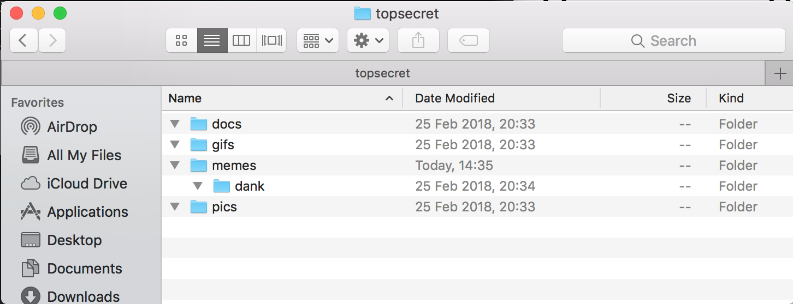

# Linux command line basics

### Change Directory (cd)

The cd command is used to navigate through directories on the command line. It is the equivalent of clicking into and out of folders in a GUI interface. 

The cd command is simple to use: ```cd [path]```

You can give it either a relative or absolute path.

Suppose we have the following folder structure:



**Let's navigate into the memes folder**

```console
user:~/topsecret/$ pwd
/Users/user/topsecret

user:~/topsecret$ cd memes/
user:~/topsecret/memes$ 

user:~/topsecret/memes$ pwd
/Users/user/topsecret/memes
```

Here we simply change directories into the memes folder. Notice that in the second line, our path changed. We are now inside that folder.

__Let's navigate into the dank folder__ 

```console
user:~/topsecret$ pwd
/Users/user/topsecret

user:~/topsecret$ cd memes/dank/
user:~/topsecret/memes/dank$ 

user:~/topsecret/memes/dank$ pwd
/Users/user/topsecret/memes/dank
```
or 

```console
user:~/topsecret$ pwd
/Users/user/topsecret

user:~/topsecret$ cd memes/
user:~/topsecret/memes$ cd dank/
user:~/topsecret/memes/dank$

user:~/topsecret/memes/dank$ pwd
/Users/user/topsecret/memes/dank
```

We can either go into the "dank" folder by giving it the full path to that folder, or by navigating twice to the "memes" folder, then to the "dank" folder.

__Cd out of a folder__

If we want change directories into the parent folder, we use ".." as the relative location.

- Up one folder: 	```cd ..```
- Up two folders: 	```cd ../../```
- Up three folder: 	```cd ../../../```
- etc...

```console
user:~/topsecret/memes/dank$ pwd
/Users/user/topsecret/memes/dank

user:~/topsecret/memes/dank$ cd ../../
user:~/topsecret$ pwd
/Users/user/topsecret
```

__Using an absolute path__

If you want your cd command to work in the same way no matter which folder you are currently in, use an absolute path. Unlike relative paths, absolute paths begin with a "/" and start from your system's root path. Relative paths start from your current folder.

The following two commands yield the same result. The latter, however, will yield the same result in any folder. 

```console
user:~/topsecret$ cd memes/dank/
user:~/topsecret/memes/dank$ 
```

```console
user:~/topsecret$ cd /Users/user/topsecret/memes/dank
user:~/topsecret/memes/dank$ 
```

